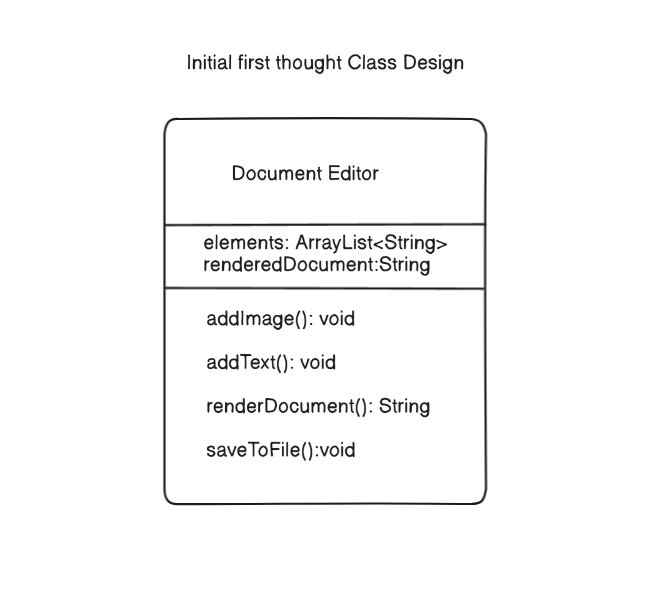
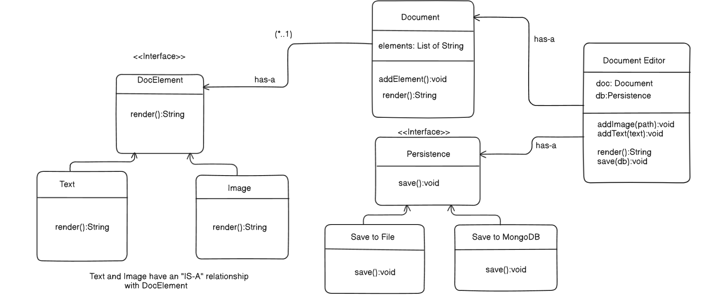

## A modular LLD for a document editor like Google Docs, engineered for text, images, and for future extensibility.

### Requirements:

1)The system must support text adding capabilities, allowing users to create and format text content dynamically.

2)The system must allow image adding capabilities, allowing users to create and add images dynamically to the  document.

3)The system must be scalable in case for future features like allowing videos,gif's etc.

## Index
- [Initial Design](#initial-design)
- [Better Design](#better-design)
- [Final Design](#final-design)

## Initial Design

->This is the first thought that came to mind after reading the requirements , I'll improve this design later after trying this out once

->Here , renderDocument() is not rendering anything but just returning a string which is being stored in the file by saveToFile()

->Now thinking about this design , it breaks single responsibility and open closed principle both so this is definitely a bad design

## Better Design:

->Now this design allows scaling of db storages and also now we can add features for adding videos or gif's etc in the future

->It follows single responsibility and open closed principle which was lacking in the previous design

->It also follows interface segregation and dependency inversion principle properly 

->Here i am assuming the editor to only have one doc to edit but in case of the actual document we should add a class called user and for each user multiple documents will be available, let's try that out some other day in the final design i guess.

## Final Design

