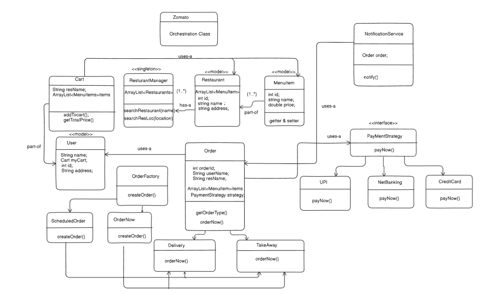

### A Delivery System Design which follows solid principles and uses clean Design Patterns

## Requirements:

1) User can search restaurant based in location
2) User can add items to cart
3) User can order successfully by making payment
4) Send a notification on successfull order

## Design 

This is a design which uses model classes for data objects, singleton principle for managers , factory method for creating Objects of Order and Strategy Pattern for payment system 